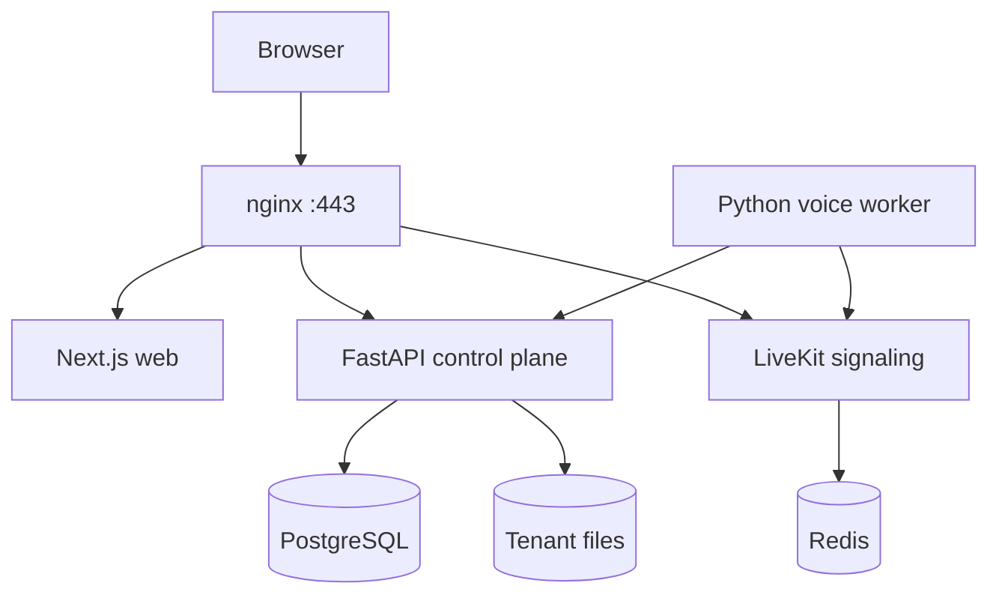
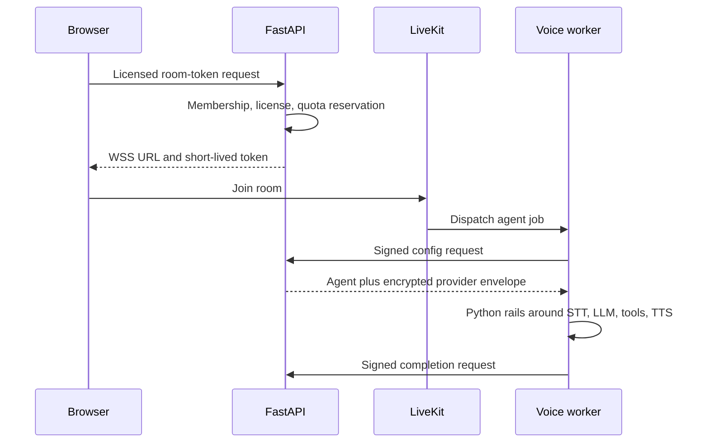

# Architecture

## Deployment topology

All components run on one host through `docker-compose.yml`. nginx routes app
traffic to Next.js or FastAPI and LiveKit WSS traffic to LiveKit. LiveKit media
uses 7881/TCP or the configured UDP range. PostgreSQL, Redis, FastAPI, Next.js,
and the worker are not directly public.

The Next.js catch-all `/api/*` handler is a server-side proxy for UI requests.
It does not authorize a workspace; FastAPI always repeats authentication,
membership, role, license, feature, and quota checks. `/api/internal/*` is
blocked by both the Next proxy and public nginx routing.

## Control plane

FastAPI owns the durable application rules:

- email/password authentication and server-side sessions;
- workspace memberships and roles;
- license issue, activation, verification, revocation, seats, features, and
  quotas;
- encrypted tenant provider connections;
- agent graphs and versions;
- chat execution and usage metering;
- LiveKit room tokens and worker-scoped agent configuration;
- recordings, files, CMS media, dashboards, analytics, and reports.

PostgreSQL is required because the API, voice completion path, and future
workers can write concurrently. Transactions and row locks serialize seat,
activation, quota, and call-reservation decisions.

## Authentication and tenant boundary

Passwords are Argon2-hashed. The browser receives an HTTP-only, Secure,
SameSite=Lax `__Host-` session cookie in production; only a hash of the session
token is stored. Superadmin authorization is separate from workspace roles.

Every tenant-owned row includes `workspace_id`. An `x-workspace-id` header or
`workspace` query value selects among the authenticated user's memberships; it
never grants membership. Conflicting selectors are rejected. Cross-tenant
lookups return a generic missing/denied response rather than revealing another
workspace's record.

Role order is `viewer < member < operator < admin < owner`. Routes specify both
a minimum role and, where relevant, a signed license feature.

## License boundary

A license key contains a canonical payload signed with Ed25519 plus a random
activation secret. The full key is shown once and only its hash/prefix is stored.
FastAPI compares the signed claims with the database row on each licensed
request. Editing dates, seats, modes, quotas, or features in only the database
therefore fails integrity verification.

A separate Ed25519 lifecycle envelope signs `unused`, `active`, `expired`, and
`revoked` state plus activation/revocation timestamps. Direct status edits are
rejected. A complete rollback to an older database image and matching signature
still requires an off-box append-only verifier to prevent.

Expected status behavior is:

- missing, inactive, expired, revoked, or quota-exhausted entitlement: HTTP 402;
- feature not licensed or provider source not allowed: HTTP 403;
- seat limit reached: new invite/acceptance is rejected.

The private signing key remains on this single host because v1 includes license
issuance in the superadmin API. A host compromise can therefore mint licenses;
an offline signing service or HSM is a future hardening option.

## Provider resolution

Provider source is part of the signed entitlement:

- `byok` decrypts only the tenant's workspace-scoped AES-GCM vault record;
- `platform` reads only the matching server environment value and meters usage;
- `hybrid` requires an explicit signed source for all five kinds: `llm`, `stt`,
  `tts`, `realtime`, and `telephony`.

There is no missing-BYOK fallback. The control plane creates a short-lived,
room-bound AES-GCM envelope for the worker containing only the resolved direct
LLM/STT/TTS credentials. It never returns those credentials to the browser or
places them in LiveKit room metadata.

One shared worker connects to one LiveKit project. In this deployment,
`realtime` must therefore be `platform` for voice-enabled licenses. Hybrid mode
still permits tenant-owned LLM/STT/TTS. Serving tenant-owned LiveKit projects
requires a worker pool partitioned by tenant/project and is outside the
single-worker design.

## Browser voice flow

Worker requests use a bearer secret plus HMAC over timestamp, nonce, method,
path, and body. FastAPI rejects expired timestamps and persisted nonce replays.
The provider envelope uses a different key and is short-lived and room-bound.

## Mandatory safety layers

`services/livekit-agent/rails.py` is platform-owned code, independent of the
tenant prompt and BYOK model.

1. Deterministic checks run before the model, at tool arguments/results, before
   persistence, and on call setup. They bound text, redact common PII, block
   payment-card input, detect supported jailbreak/blocked-topic phrases, enforce
   deny-by-default tool/webhook allowlists, enforce call length, and require
   server-verified outbound/recording consent.
2. Complete model output is inspected before any audio is sent to TTS. Supported
   medical/legal conclusions, invented customer data, and uncertainty patterns
   are replaced with a safe handoff response.

Regex and phrase policies are risk-reduction controls, not proof of universal
safety. They require red-team tests for each language and use case.

The Studio `Guardrail` node means a workflow-level human-approval gate. It
cannot weaken the platform rails. Real approval orchestration and real SIP
transfer remain phase-two execution work.

## Files and backups

FastAPI alone receives the files bind mount. Storage keys are tenant-prefixed,
for example `knowledge/w42/` and `recordings/w42/`, and are resolved beneath the
configured root. nginx does not serve the directory directly. The PostgreSQL
dump, tenant files, `.env`, credential master key, worker keys, license signer,
and TLS key form one recovery set and must be encrypted off-host.

## Scaling boundary

This design optimizes simplicity, not high availability. The droplet, local
disk, public IP, and shared LiveKit worker are single failure/concurrency
domains. Scale-out requires object storage, managed or replicated PostgreSQL,
worker routing by LiveKit project/tenant, shared rate limiting, observability,
and a tested migration plan. Do not place two releases over the same local
files directory.
